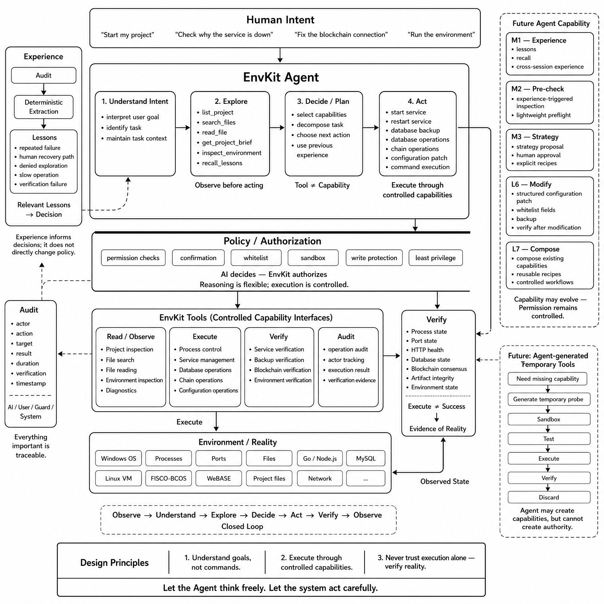

<div align="center">


# EnvKit

**单文件 · 零依赖 · 内置可验证 Agent 的 Windows 开发环境助手**

在一台全新的 Windows 机器上，完成 **Go / Node.js / MySQL 环境安装 → 项目配置 → FISCO-BCOS 链端运维 → 前后端应用启动** 的全流程部署，所有操作经由浏览器向导完成。

[](https://go.dev)
[](https://github.com/hrui83771-gif/EnvKit)
[](https://github.com/hrui83771-gif/EnvKit/releases)
[](LICENSE)
[](https://github.com/hrui83771-gif/EnvKit)

</div>

---

## 一、核心主张

> **Execution is not evidence. — 执行完成不等于环境恢复。**

命令返回 0 不代表服务可用；进程派生不代表端口已监听；备份文件生成不代表它能被还原。多数工具向模型暴露的是前者的结果，EnvKit 只承认后者。

| 层面 | 机制 | 解决的问题 |
|---|---|---|
| Contract | `OpResult{Ok, Verified, Evidence, ErrKind}` 取代 `error` | 失败被外层吞掉，模型只能硬编码「已启动」 |
| Verification | 服务 / 备份 / 链端三类验证器，判据为端口监听、存活观察、HTTP 握手、SHA256 复算、共识视图推进 | 命令成功被误报为环境已恢复 |
| Policy | 统一权限裁决器给出四档结论，禁止档在派发前终止 | 「什么算危险」分散在多处判定，换个入口即可绕过 |
| Trace | 每次任务留下完整轨迹（计划 / 动作 / 证据 / 复验 / 人工介入），跨会话累积 | 失败模式无从归因，经验退化为凭空总结 |
| Memory | 经验带作用域、证据与置信度，随项目变化失效，可被新证据纠正 | 进程重启后从零开始，或把别的项目的经验错套到当前项目 |

---

## 二、Agent 架构

下图给出系统架构。左列为证据来源，中部为 Agent 的四阶段决策流程与其受控的能力接口，右侧为能力演进路线。



三条设计约束决定了系统在异常情况下的行为：

**1. 推理灵活，执行受控。** 模型可自由决定调用顺序与组合方式，但所有副作用必须经由已注册的 23 个工具接口发出。EnvKit 不提供「执行任意命令」的能力，模型无法绕过工具层直接操作系统。

**2. 权限由系统裁定，而非由模型裁定。** 工具返回成功仅表示「命令已发出」；是否可向用户确认「已完成」，由验证器的客观结论决定。

**3. 经验只影响决策，不改变权限。** 记忆层改变的是模型的行动选择（先查什么、是否原样重试），而非任何操作的授权边界。该约束不依赖提示词自觉：裁决器不读取任何记忆字段，构造「所有写操作都免确认」的极端记忆后，数据库还原与危险脚本仍分别处于最高确认档与禁止档。经验与用户指令冲突时，以用户指令为准。

---

## 三、基准数据

### 3.1 运行质量（580 条真实操作审计）

```
EnvKit Agent · Operation Metrics
────────────────────────────────────────────────
Audit Records            580      操作审计全量样本
  AI Operations          230      模型发起的操作
  Human Operations       340      用户手动操作
  Guard / System          10      后台守护与系统事件
  Exploration Calls      146      自主项目探索（list 43 / search 41 / read 62）
  Verification Calls      38      主动复验（service 27 / chain 11）
  Boundary Rejections      6      越界与敏感文件拒绝
  Traced Records         132      挂上 trace_id 的任务（可回溯完整轨迹）
────────────────────────────────────────────────
Operation Success       96.1%     539 ok / 22 fail
Latency p50            1345 ms
Latency p90            3331 ms
────────────────────────────────────────────────
```

数据取自本机长期使用的真实审计日志，非构造样本。复现方式见 3.4。

### 3.2 工程质量

```
Quality Gates
────────────────────────────────────────────────
Unit Tests               330      契约 / 验证器 / 记忆提取 / 沙箱 / 配置合并
Smoke Suite               20      固定 fixture 驱动的端到端能力断言
CDP Regression            13      真实 Chromium 驱动的端到端场景
E2E AI Acceptance         14      真实模型对话的行为验收
────────────────────────────────────────────────
Go Source             16,019      行，64 个文件
Frontend              4,155      行，单文件内嵌
i18n Entries             623      中英双语
Third-party Deps           2      仅 SSH 与 WebSocket
────────────────────────────────────────────────
```

### 3.3 关键验证结论

以下均来自真实环境，非构造数据。

| 验证项 | 环境 | 结论 |
|---|---|---|
| 链端活性判据 | 4 节点 FISCO-BCOS 2.11.0 | 空闲时 6 秒内块高 `1105 → 1105`，共识视图 `869695 → 869701`。据此判定「块高静止」为空闲链正常表现，并将健康判据由块高改为**共识视图推进** |
| 项目自主探索 | Go + Vue 项目，25,842 文件 | 模型自主完成 8 轮工具调用，定位数据库连接串于 `server/main.go:16`，敏感字段自动脱敏为 `root:***@tcp(...)` |
| 失败模式提取 | 418 条审计 | 产出 10 条有效经验；首版为 13 条，其中 3 条系误判（将成功的复验判定为重复失败） |
| 启动方式推断 | 4 类前端 fixture | `npm run dev` / `serve` / `start` 均正确识别；`build` `deploy` `migrate` `lint` 等被安全规则拒绝；全为危险脚本时明确拒绝启动而非静默回退 |
| 生命周期验证 | 构造「启动即崩」 | 端口曾监听但进程在观察窗内消失 → 判为 `crash_after_start` 并附日志尾部，不再报「已就绪」 |
| 备份可还原性 | `--skip-triggers` 生成的备份文件 | 文件完整、sha256 一致，但静态检查查出触发器全丢——**文件没坏不等于能还原** |
| 环境符合性 | `go.mod` 要求 1.25 / 实际 1.23.6 | 报「不满足项目要求」并给出可执行处置；项目未声明要求时明说「未声明」而非「符合」 |
| 敏感文件防护 | 含数据库与 SSH 密码的 `config.json` | 拒绝读取并说明原因，模型转而获取同目录模板文件 |
| 越界访问防护 | 系统 `hosts` 文件 | 拒绝访问，模型未尝试绕过 |
| 经验作用域 | 切换项目目录后 | 该项目积累的经验标记为失效并不再注入；标记为全局的条目跨项目保持生效 |

### 3.4 复现方式

```bash
go test ./...                    # 单元测试
node tools/cdp_verify_test.js    # 浏览器回归（需先启动 EnvKit）
python tools/e2e_agent_test.py   # 端到端 AI 行为验收（需配置模型 API Key）
python tools/dist_check.py       # 分发包泄漏扫描
```

---

## 四、界面预览


---

## 五、功能模块

| 模块 | 说明 | 关键能力 |
|---|---|---|
| **环境安装** | 全新机器自动配齐 Go / Node.js / MySQL | 镜像加速下载、SHA256 完整性校验、失败自动重试、GOPROXY 与 npm registry 自动配置、演练安装（不落盘） |
| **程序配置** | 项目与数据库向导式配置 | 建库建表、备份/还原/演练、配置导入导出（自动脱敏）、字段级校验、自动保存 |
| **链端运维** | FISCO-BCOS v2 / WeBASE-Front | SSH 内嵌终端、节点进程存活统计、区块高度与交易数读取、宕机自动恢复、**主机可达性三态判定** |
| **程序启动** | 前后端一键启停 | Job Object 进程树回收、端口占用诊断、启动脚本自定义、网页端可控退出 |
| **Agent 助手** | 浏览器内的运维 Agent | 23 个工具、四档权限裁决、实时执行计划、任务轨迹、记忆与经验层 |
| **操作审计** | 全量操作留痕 | 主体 / 动作 / 目标 / 结果 / 耗时 / 复验结论 / 任务轨迹 ID，按天分文件保留 30 天 |

### 工具清单（24 个）

| 类别 | 工具 |
|---|---|
| 环境观测 | `get_system_state`　`get_logs`　`get_diag_report`　`run_detection`　`db_check`　`check_env_req`　`get_project_brief`　`get_env_snapshot`（只读：读自己这一回合的输入） |
| 项目探索 | `list_project`　`search_files`　`read_file` |
| 服务控制 | `start_service`　`restart_service`　`stop_service`　`cleanup_processes` |
| 数据操作 | `db_query`（只读）　`db_list`（只读）　`db_backup`　`list_backups`（只读）　`apply_whitelist` |
| 验证 | `verify_environment` |
| 链端 | `get_chain_guard`（`chain_autorecover` 是配置开关，不是工具） |
| 记忆 | `recall_lessons`　`manage_memories` |

---

## 六、安全模型

| 机制 | 实现 |
|---|---|
| 权限裁决 | 所有写操作先经统一裁决器定档：`auto` / `confirm` / `elevated` / `forbidden`。判定为禁止的动作在派发前即终止，模型无法通过换入口绕过 |
| 确认闸门 | 需确认的动作以 HTTP 428 由服务端强制返回，模型无法跳过；高危动作用红色警示样式 |
| 权限边界 | 系统仅暴露 23 个受控接口，不提供任意命令执行能力 |
| 记忆非权限 | 用户记忆与自动经验只能调整建议的呈现方式与排序，**不改变任何动作的权限档位**。该约束由单测结构性保证（构造「所有写操作都免确认」的极端记忆后，还原与危险脚本仍分别处于最高档与禁止档） |
| 提示注入防护 | 日志、工具输出、项目文件均以不可信定界符包裹，其中的指令性文本不被执行 |
| 凭据保护 | API Key 与数据库密码经 Windows DPAPI 加密存储；配置、审计与诊断包入库前完成脱敏 |
| 密钥文件 | 私钥、凭据类文件纳入拒绝读取清单，命中即拒绝并留痕 |
| 路径沙箱 | 文件探索限定于已配置的项目目录，越界路径拒绝并记录审计 |
| 启动命令安全 | 启动脚本取自项目 `package.json` 的白名单交集，`deploy` / `migrate` / `reset` / `drop` 一律拒绝；无法识别时明确拒绝而非猜测 |
| 进程回收 | 子进程绑定 Windows Job Object，无论正常退出或进程被杀，服务树均由系统回收 |
| 主机密钥校验 | 首次连接按 TOFU 记录指纹，后续变化即拒绝；虚拟机重建场景提供明确处置指引 |
| 审计 | 全部操作留痕，含执行主体、目标、结果、耗时、复验结论与所属任务轨迹 ID |

---

## 七、快速开始

### 方式一：下载可执行文件（推荐）

从 [Releases](https://github.com/hrui83771-gif/EnvKit/releases) 下载最新版本，解压后运行 `EnvKit.exe` 或 `安装.bat`，浏览器将自动打开向导（默认 `http://127.0.0.1:18765`，端口冲突时自动避让）。

### 方式二：从源码构建

```bash
git clone https://github.com/hrui83771-gif/EnvKit.git
cd EnvKit
go build -trimpath -ldflags "-s -w" -o EnvKit.exe .
./EnvKit.exe
```

图标与版本信息经 `resource.syso` 编入可执行文件，直接 `go build` 即可产出完整工件。

### 部署流程

按 **环境安装 → 程序配置 → 链端运维 → 程序启动** 四步推进，每一步均配备独立的实时日志。

**前提条件**

- MySQL 绿色版需要 [VC++ 2019 Redistributable (x64)](https://learn.microsoft.com/zh-CN/cpp/windows/latest-supported-vc-redist)；
- 注册或启动 MySQL 服务需要管理员权限；
- 首次运行需联网下载组件包（约 180 MB，可配置下载代理加速）。

### 配置

在可执行文件同目录放置 `config.json` 即可覆盖内置默认值，涵盖组件版本、下载地址与校验和、GOPROXY、npm registry、下载代理、MySQL 参数、项目目录与链端 SSH 配置等。仓库内的 `config.dist.json` 为带注释的干净模板。

---

## 八、项目结构

```
main.go            Web 服务、SSE 实时日志、路由注册
detect/install.go  环境检测与安装（下载重试、SHA256 校验）
program.go         项目配置、前后端启停、进程树管理
dbops.go           建库建表、备份 / 还原 / 演练
chain.go           链端运维（SSH、端口、REST、可达性三态、自动恢复）
verify.go          三类验证器：服务 / 备份 / 链端
opresult.go        操作结果契约（Ok / Verified / Evidence / ErrKind）
policy.go          权限裁决器（auto / confirm / elevated / forbidden 四档）
runtime.go         运行时统一状态源（服务状态机、问题清单）
svcstate.go        服务状态注册表（端口漂移、复验结论、连续失败计数）
lifecycle.go       进程生命周期验证（存活观察窗、崩溃取证）
launch.go          启动方式推断（前端脚本白名单、后端入口）
envreq.go          环境符合性检查（项目要求 vs 实际版本）
explore.go         项目文件探索沙箱
projectbrief.go    项目画像识别
trace.go           任务轨迹（trace_id 贯通、单任务完整过程）
trace_phase.go     轨迹的计划 / 权限 / 人工介入环节
plan.go            工具调用预算与执行计划
replan.go          重复失败检测与换思路引导
lesson.go          自动经验提取（审计的统计视图）
scope.go           经验与记忆的作用域、置信度与失效判定
memory.go          用户记忆存储与注入
ai_dbquery.go      数据库只读查询工具
guardstate.go      链端守护状态视图
audit.go           操作审计流
ai*.go             Agent 运行时（工具注册表、意图回溯、滚动摘要、确认闸门）
webterm.go         WebSocket → SSH PTY 桥接
web/index.html     向导前端（内嵌编译）
```

第三方依赖仅 `golang.org/x/crypto`（SSH）与 `nhooyr.io/websocket`，其余均为 Go 标准库。

---

## 九、路线图

| 版本 | 内容 | 状态 |
|---|---|---|
| v2.0 | 执行→验证闭环、记忆层、审计可见化、项目探索 | 已完成 |
| v2.1 | 启动方式推断（不再硬编码 `npm run serve`）、评测基线与冒烟集 | 已完成 |
| v2.2 | 统一权限裁决器、任务轨迹、进程生命周期验证、统一运行时状态源 | 已完成 |
| v2.3 | 轨迹补齐计划与人工介入、经验作用域与置信度、备份可还原性、环境符合性、执行计划可见、数据库只读查询 | 已完成 |
| v3.0 | 首页改为项目状态中心，能力按工作区收纳，保留完整手动驾驶权 | 计划中 |
| v3.1 | 系统级评测集与自动化 Harness，以回归数据证明版本间的能力增益 | 计划中 |

---

## 十、许可证

[MIT](LICENSE)

## 免责声明

本软件按「现状」（AS IS）提供。作者不对其准确性、可靠性、适用性作任何明示或暗示的担保，使用本软件产生的任何后果由使用者自行承担。依赖的第三方组件（Go、Node.js、MySQL、FISCO-BCOS、WeBASE 等）的版权与许可归各自权利方所有。链上数据仅供参考，不构成任何投资、法律、财务或商业建议。完整声明见软件内「关于 / 免责声明」。
