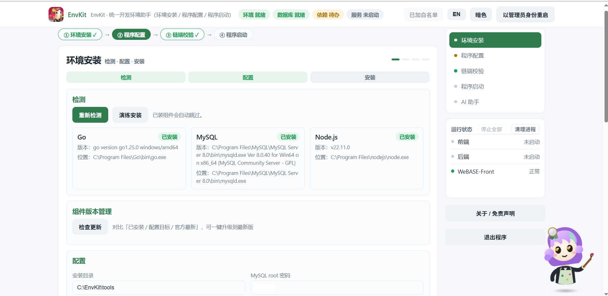

<div align="center">


# EnvKit

**单文件 · 零依赖 · 带 AI 运维助手的 Windows 开发环境助手**

帮你在一台全新的 Windows 机器上，一条龙完成 **Go / Node.js / MySQL 环境安装 → 项目配置 → FISCO-BCOS 链端校验 → 前后端应用启动**，全程浏览器向导操作。

[](https://go.dev)
[](https://github.com/hrui83771-gif/EnvKit)
[](https://github.com/hrui83771-gif/EnvKit/releases)
[](LICENSE)

</div>

---

## 主要功能

| 模块 | 一句话说明 | 关键能力 |
|---|---|---|
| **环境安装** | 全新机器自动配齐 Go / Node.js / MySQL | 国内镜像下载、SHA256 完整性校验、失败自动重试、自动配置 GOPROXY 与 npm registry、演练安装（不落盘） |
| **程序配置** | 项目与数据库向导式配置 | 建库建表一步到位、数据库备份/还原/演练、配置导入导出（支持脱敏）、自动保存与前置校验 |
| **链端校验** | FISCO-BCOS v2 / WeBASE-Front 运维 | SSH 内嵌终端（xterm.js）、节点进程存活统计、区块高度/交易数读取、宕机自动重启、智能区分"仅本地绑定"与"真宕机" |
| **程序启动** | 前后端一键启停 | 进程树管理（Job Object 兜底回收，不留孤儿进程）、端口占用一键诊断、启动脚本自定义、网页端可控退出 |
| **AI 运维助手** | 浏览器内的运维副驾「小画师」 | 11 个工具覆盖状态/日志/DB/启停，写操作强制确认闸门，感知快照 + 滚动摘要，防提示注入，全程审计 |

**核心卖点：**

- **单文件即全部** —— 纯 Go 实现，前端内嵌编译进 exe，双击就跑，无运行时、无安装器。
- **安全默认** —— API 令牌防 CSRF、破坏性操作二次确认（高危红框）、AI 写操作服务端强制 428 确认、每次操作可审计。
- **进程零残留** —— 子进程绑定 Windows Job Object，EnvKit 无论正常退出还是被杀，服务树都会被系统回收。
- **AI 不做贴皮** —— 每回合注入环境快照（含最近错误），长对话滚动摘要防遗忘，日志内容按不可信数据处理防注入，所有 AI 写操作计入审计（actor=ai）。

## 界面预览



## 快速开始

### 方式一：下载可执行文件（推荐）

从 [Releases](https://github.com/hrui83771-gif/EnvKit/releases) 下载最新版（当前 [v1.10.3](https://github.com/hrui83771-gif/EnvKit/releases/tag/v1.10.3)），解压后双击 `EnvKit.exe` 或运行 `安装.bat`，浏览器自动打开向导（`http://127.0.0.1:18765`，端口冲突自动避让）。

### 方式二：从源码构建

```bash
git clone https://github.com/hrui83771-gif/EnvKit.git
cd EnvKit
go build -trimpath -ldflags "-s -w" -o EnvKit.exe .
./EnvKit.exe
```

图标与文件属性（版本信息）已通过 `resource.syso` 编入 exe，直接 `go build` 即可获得完整产物，无需安装任何资源工具。

### 使用流程

按 **环境安装 → 程序配置 → 链端校验 → 程序启动** 四步推进，每一步都有独立实时日志（自动清理 ANSI 乱码、错误行高亮）。

**前提条件：**

- MySQL 绿色版需要 [VC++ 2019 Redistributable (x64)](https://learn.microsoft.com/zh-CN/cpp/windows/latest-supported-vc-redist)；
- 注册 / 启动 MySQL 服务需要管理员权限；
- 首次运行需联网下载组件包（约 180MB，可配置下载代理加速）。

### 自定义（不改代码）

在 exe 同目录放一份 `config.json` 即可覆盖内置默认：组件版本 / 下载 URL / sha256 校验、GOPROXY、npm registry、下载代理、MySQL 参数、项目目录、链端 SSH 配置等。仓库内的 `config.dist.json` 是带注释的干净模板。

## AI 运维助手

兼容任意 OpenAI 协议模型（baseURL / 模型 / Key 可配，Key 经 Windows DPAPI 加密存储）。

- **工具调用**：系统状态、日志检索、数据库检查、环境检测、服务启停/重启、备份、Defender 白名单、进程清理等 11 个工具；
- **确认闸门**：写操作一律先弹确认卡，高危操作红框警示，服务端强制二次确认（HTTP 428），AI 无法绕过；
- **感知与记忆**：每回合自动注入环境状态与最近错误摘要；长对话自动滚动摘要，最近消息原样保留；
- **安全防护**：日志等外部内容以不可信定界符包裹，防提示注入；每次 AI 写操作计入审计（actor=ai）；
- **透明可控**：用量与余额可见、随时停止生成、对话历史本地持久化、出错一键直达日志或 AI 分析；
- **无 Key 可用**：AI 未配置时功能完整降级，不影响其余模块。

## 测试

```bash
go test ./...
```

- 后端单测覆盖意图判定、摘要切分、诊断、工具协议等；
- 前端回归用 CDP 驱动真实 Chromium（`tools/cdp_*.js`，Node 22 原生 WebSocket），覆盖数据浏览、端口诊断、AI 历史、退出流程等端到端场景；
- HTTP 链路回归见 `tools/test_*.py`；发布前 `tools/dist_check.py` 对分发包做泄漏扫描（个人字段 / 真实 IP / 密钥）。

## 架构

```
main.go            Web 服务 + SSE 实时日志 + 路由注册
detect/install.go  环境检测与安装（下载重试 / SHA256 校验）
program.go 等      项目配置、前后端启停、进程树、端口诊断
dbops.go           建库建表、备份 / 还原 / 演练
chain.go           链端校验（SSH / 端口 / REST / 自动恢复）
webterm.go         WebSocket → SSH PTY 桥接（内嵌终端）
ai*.go             AI 助手（工具注册表 / 意图回溯 / 滚动摘要 / 确认闸门）
winjob / console   Windows Job Object 进程守护与控制台生命周期
audit / security   审计、API 令牌防 CSRF、配置持久化
web/index.html     向导前端（内嵌编译进 exe）
```

依赖极简：仅 `golang.org/x/crypto`（SSH）与 `nhooyr.io/websocket` 两个第三方库，其余全部 Go 标准库。

## 许可证

[MIT](LICENSE)

## 免责声明

本软件按"现状"（AS IS）提供，作者不对其准确性、可靠性、适用性作任何明示或暗示的担保，使用本软件产生的任何后果由使用者自行承担。依赖的第三方组件（Go、Node.js、MySQL、FISCO-BCOS、WeBASE 等）版权与许可归各自权利方所有；链上数据仅供参考，不构成任何投资、法律、财务或商业建议。完整声明见软件内「关于 / 免责声明」。
